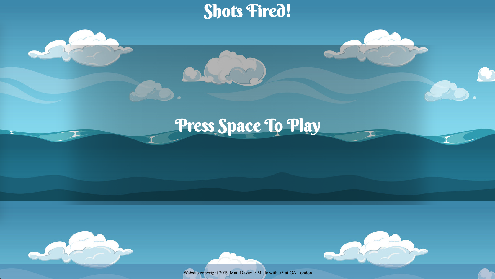
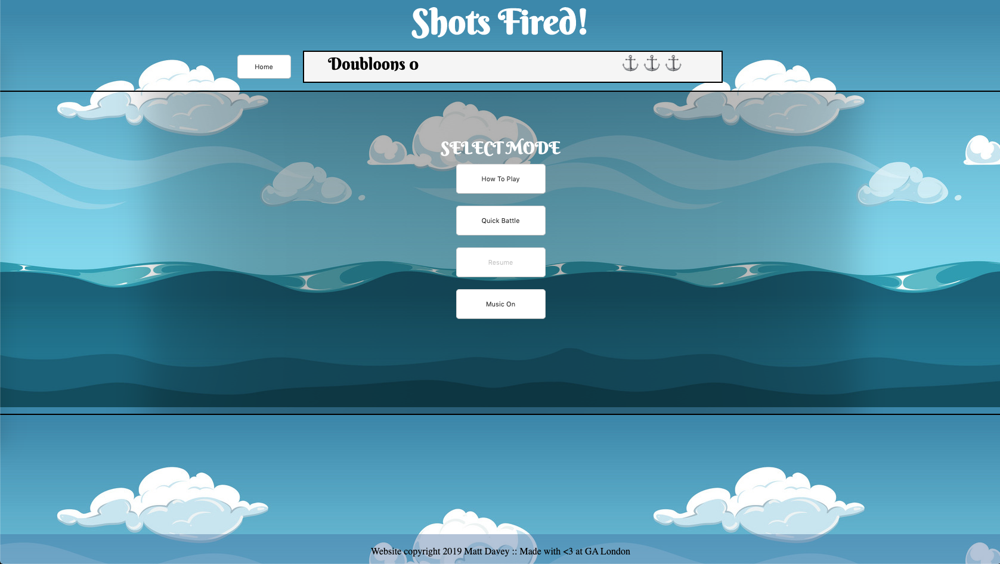
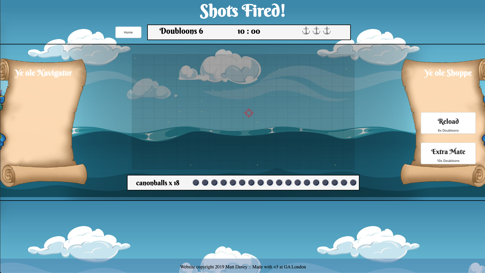
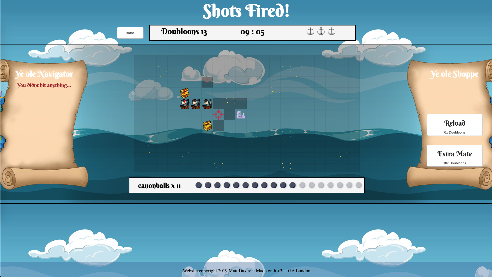

# Shots Fired!


## Software Engineering Immersive: Project 1
This was the start of my 7 day game development project, as part of my 3rd week on the General Assembly SEI course.

#

## The Battleships-Minesweeper game, with a twist!
This project is built entirely with vanilla javascript, HTML and CSS.


#### Credits
Credit to the BBC Sound Effects library for use of sound effects,
Bob Bradley (PRS) for the use of Gypsy Sailor (licensed by Audio Network), Daniel Eden for use of Animate.CSS a cross-browser library of CSS animations.

#


#### Breif
I developed my own brief for this project, combining multiple flavors from two games; Minesweeper and Battleships. My goal was to build a game with many layers of game logic, which would enable the end user to make careful decicions during their gameplay, resulting in risk-reward scenarios.


Shots fired is a single player game, in which the user has limited resources to discover and take out all enemy ships that are procedurally generated on a 220 tile map.

Ships generate in a 3x1 rectangle, and can generate either vertically or horizontally on the map.

Resources are limited; the player will start with 18 cannonballs to fire, 6 Doubloons to spend at the shop, 3 health and 10 minutes to complete a quick game.


A win condition is met once the player takes out all the ships. A total score is accumulated by the following:
* Every 10 seconds left on the clock rewards 1 point
* Every canonball remaining rewards 1 point
* Every doubloon earnt rewards 1 point 
    *(excluding starting money and excluding any losses throughout the game)*
* Every health remaining rewards 10 points

Lose conditions are defined, if any of the following are met:

* The timer runs out
* Player runs out of health
* Player runs out of Cannonballs and has less than 6 Doubloons to purchase more

The game also generates hidden trap tiles in which will take away player lives when activated.

* Sea mines will directly affect a players health by minus 1
  
  Sea mines will trigger a proximity indicator when the player attacks a tile within a 1-tile raidus of the trap.

* Sirens are the second trap and their behavour is based on two conditions: 

  If the player has 5 or more Doubloons, the Siren will steal 5 Doubloons from the player.

  If the player has less than 5 Doubloons the Siren will attack the player's health directly

* Loot is also scattered across the map, in which will reward the player with 6 Doubloons when attacked. 

  Doubloons can be spent at the store for additional cannonballs or health and also contribute to your final end score.

  Loot also has a proximity inidcator, however loot indicators are always visible on the map.

  As well as loot, hitting ships reward the player with additional loot. Loot is decided via RNG on a 12-die roll, any even number will return ammo, 1, 3 and 5 results in health, anything else wont return a reward.

  

# Deployment
Shots Fired is deployed via GitHub io and can be found at 
https://nuclearsheep540.github.io/deepsea/

# Design

In order to work around google chromes auto-play blocker, Shots Fired! has a landing page requesting user input to initate the page's logic and assets.



In order to support multiple layers within the site, I built a 'home page' for the game. All 'pages' are controlled with event listeners toggling CSS styling, this prevents users from making multiple calls to a server every time they want to navigate through the game menus, and also creates a more steamlined experience, visually as well as in terms of responsiveness.




The player starts in the centre of a 20x11 (220 tile) map.

Arrow Keys, AWSD Keys are programmed to move the attack cursor and Spacebar is programmed to perform an attack.




Visuals indicate what you're interacting with:
* A navigator confirms every hit, miss and event that occurs in-game
* Treasure chests indicate you've struck Doubloons
* Ships indicate you've successfully hit a Ship
* Sirens indicate you just hit a Siren
* Black mines indicate you just hit a Sea Mine
* Red Exclamation marks indicate you're within proximity of a Sea Mine
* Grayed blocks indicate somewhere you've attacked, which had nothing there.
* The red crosshair indcates your current targetting position

On every attack, multiple checked are being performed:
* If the gamestate is in play

 *The game can be paused, and navigated away mid-game by clicking the home button at any point*

* Is the player still in-play
* Are attack conditions met; 
    * Has the canon has successfully completed it's re-loaded
    * Are there sufficient cannonballs remaining
    * Has the tile targeted, not already been fired at
* What is under the tile, that needs to be displayed post-attack
* What values are being returned to the player, post-attack
    
*If any of these conditions dont comply, the game will react accordingly to whatever condition didnt pass the check. i.e attacking the same tile will not fire the cannon, or running out of cannonballs with no money left will result in a lost game, or if the player is not in play all input is to be ignored.*

## Procedurally Generated Logic

A lot of the logic behind the game board is procedurally generated with random math alongside statement based checks.

```javascript
       // GENERATE VERTICAL BOATS

    function makeBoatV(a, b, c) {
      const boatV = [a,b,c]
      console.log('boat v = ', boatV)
      boatV.forEach((boat) => {
        cells[boat].classList.add('boat')
      })
    }

    function checkBoatV(){
      const boatA = (randomiseOne(179))
      const boatB = (boatA + 20)
      const boatC = (boatB + 20)
      if (!cells[boatA].classList.contains('boat') && !cells[boatB].classList.contains('boat') && !cells[boatC].classList.contains('boat')){
        makeBoatV(boatA, boatB, boatC)
      } else {
        checkBoatV()
      }
    }

    for (let i = 0; i < 3; i++) {
      checkBoatV()
    }

    //END OF GENERATE HORIZONTAL BOATS
```

The example above is how horizontal boats are generated behind the map; for every instance of a boat, a check is first performed, which once passes, the boat is generated and then styled.

Using my random math function, I'm able to limit the bounds in which a random number can generate, here I am able to prevent a horizontal boat from generating past the game board's index.

I also check that the boat is within 3 tiles from the row edge using modulus math, this is to prevent any generated boats from passing over multiple rows - to always pertain boats in the same row as creation.

Once the check is complete, a boat can generate in the next 2 adjacent cells, and be styled appropraitely. 
#
Single tile loot was easier to generate, however there are still checks to pass before generation is allowed to be called.
```javascript
    // GENERATE LOOT
    // CREATE PLACEMENT CHECK

    const loot = []
    function checkLoot() { 
      loot.pop()
      makeLoot()
    }
    function makeLoot() { 
      const add = (randomiseOne(219)) 
      if (cells[add].classList.length < 1) { 
        loot.push(add) 
      } else {
        checkLoot() 
      }
    }
    for (let i = 0; loot.length < 20; i++) {
      makeLoot()
    }
    loot.forEach((e) => { 
      cells[e].classList.add('loot')
    }) 
```
All single tile generation starts by being contained in an array, allowing me to store all successfull tile candidates inside one variable, and pop any bad values out.

First our check makes sure that the tile selected by my RNG function, hasn't already been selected durinthe creation of the board. If the number is bad, it will be popped out and told to count again

Successful numbers, are stored inside the array, ready to be styled.


#

In order to generate proximity warnings, I first defined what a radius looks like, by storing variables of every adjacent tile in an array. Using this variable, I'm able to map it against any index called by the player, which can in turn check for any tiles with traps under them.

  ``` javascript
     function attack() {
      const rad = [
        playerIdx + 1,
        playerIdx - 1,
        playerIdx + 19,
        playerIdx + 20,
        playerIdx + 21,
        playerIdx - 19,
        playerIdx - 20,
        playerIdx - 21
      ]
      rad.map((tile) => {
        if (cells[tile]) {
          if (cells[tile].classList.contains('trap')) {
            console.log('FOUND A TRAP')
            alertMp3.play()
            cells[tile].classList.add('trap-prox')
            cells[playerIdx].innerHTML = '!'
          }
        } else {
          return
        }
      })
```